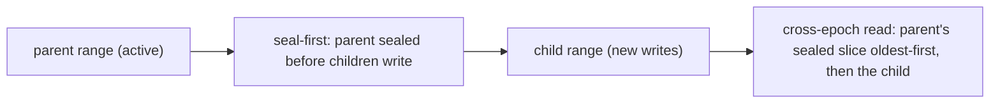
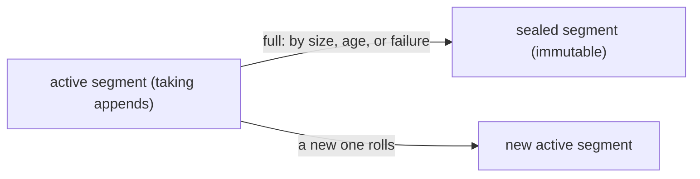
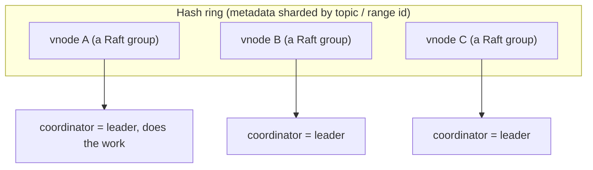
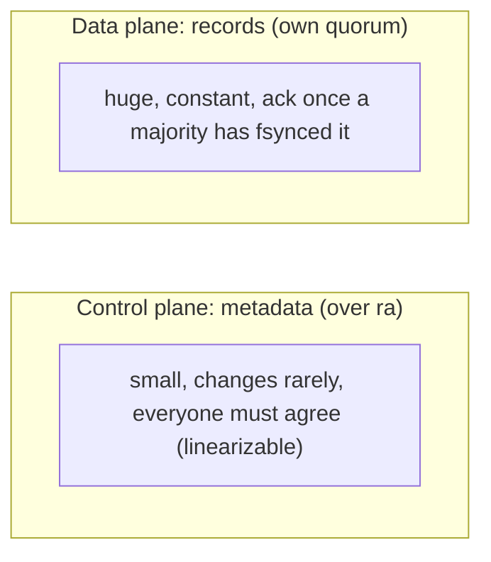
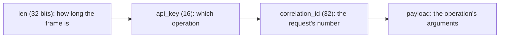

# Architecture

Malachi is a CP (consistent, partition-tolerant), horizontally scalable **log broker**, written entirely
in Elixir on the BEAM. It follows LinkedIn's NorthGuard log-storage design: clients speak topics, keys, and
opaque cursors, never partitions or offsets, so the broker can split, merge, and restripe its storage
underneath without breaking them. The control plane (metadata) is replicated by quorum through Raft (the
`ra` library); the data plane (records) uses its own quorum replication; cluster membership uses SWIM.

This document describes how the system is built and the reasons behind the load-bearing choices. For how to
use it, see the guides; for the auth design, see the [auth ADR](AUTH_USER_MANAGEMENT.md).

## The log model

```
Topic   ── a named collection of Ranges covering the whole keyspace
 └ Range  ── a log for a contiguous band of keys (active | sealed)
    └ Segment ── the unit of replication: a sequence of records (seals at 1 GB / 1 h / on failure)
       └ Record ── key + value + headers (bytes), at a logical offset within the segment
```

A record's key hashes to a position in the topic's keyspace, and that position falls in exactly one range.
Records with the same key land in the same range and are ordered relative to each other.

**Range split and merge are purely logical metadata operations.** Segments are never physically combined or
copied; a merge happens only between buddy ranges (buddy-allocator style). Total ordering is preserved
through happens-before on splits and merges. Because a range can split or migrate at any time, the client
never sees an offset: its position is an **opaque cursor** it carries and passes back, and the server is
free to reshape ranges without invalidating it.

This is the departure from partition-and-offset systems like Kafka, where the client-visible partition is
`hash(key) mod partitions`, so raising the partition count relocates a key and breaks its per-key ordering.
Here **same-key ordering survives resharding**. The key hashes to a fixed range whose single primary
serializes appends; a split applies a **seal-first fence** (the parent range is sealed before either child
accepts a write), and a read of a child chains **cross-epoch**, draining the parent's sealed slice of the
keyspace oldest-first before the child's own records. So a key stays in one child and its history reads in
order straight through the split, with no partition count for a client to have frozen into its assumptions.



## Storage layer

Storage is a pluggable behaviour, `Malachi.Storage.SegmentStore`, so the on-disk format is decoupled from
any one implementation. A store opens or recovers a segment, appends batches of records, `sync`s (fsync)
before the write is acked, `read`s a range of records, `seal`s a segment to make it immutable, and decides
when to seal (by size, age, or on failure). See the module for the full callback set.

The shipped implementation is pure Elixir: `:file` in `[:raw, :binary]` mode, batching by roughly 10 ms / N
records / N bytes, an `fsync` before every ack, and a sparse index. A native store (a Rust NIF with
`O_DIRECT`, aligned buffers, and an application-level cache) is a possible future optimization; it is
justified by the latency tail and page-cache behaviour under many concurrent segments, not by throughput.
On the storage critical path the pure BEAM sustains hundreds of MB/s with durable fsync, well above the
tens of MB/s per broker the workload calls for, so throughput is not the bottleneck. Reproduce the
measurement with `mix run benchmark/storage_viability.exs`.



> **Analogy.** A segment is a notebook: you keep writing on the current page until it is full, then you
> close that notebook for good (seal it, never edited again) and open a fresh one. Because closed notebooks
> never change, copying them to another node is safe.

## Metadata: DS-RSM over `ra`

Metadata (topics, ranges, segments) lives in a **directory of sharded replicated state machines**:

- A **vnode** is a Raft group (an `ra` cluster) holding one shard of the metadata.
- A **coordinator** is the vnode's leader; it carries the business logic: sealing or deleting a topic,
  splitting or merging a range, choosing segment replica sets, and healing under-replicated segments.
- vnodes sit on a hash ring (consistent hashing) keyed by topic name, and by range id for ranges and
  segments. A vnode's position on the ring is stable even as its Raft replicas join and leave, and a vnode
  can **split**, breaking its state into two Raft groups.



> **Analogy.** Each vnode is a small committee that votes on its own slice of the metadata. The chair (the
> leader, called the coordinator) carries out what the committee agrees on. Sharding means many small
> committees instead of one giant meeting that everything has to wait on.

The metadata state machine is `Malachi.Cluster.MetadataMachine` (`@behaviour :ra_machine`). It is a pure
function of its input: it never reads the wall clock, configuration, or `node()`. Anything time- or
config-dependent travels inside the command, and the machine reads the `meta.system_time` its server feeds
it. This keeps every replica deterministic, which is what Raft requires.

## Membership: SWIM

Broker membership uses SWIM: random probing for failure detection plus infection-style dissemination. It
spreads only **minimal global state**: each broker's host, port, and attributes, plus vnode boundaries,
leader, and term for routing. Everything larger stays in the per-vnode Raft groups.

## Replication: two planes

Replication is split deliberately, because metadata and records have opposite shapes:

- The **control plane** (metadata) runs over `ra`. Metadata is small, changes rarely, and needs
  linearizability, which is exactly Raft's strength.
- The **data plane** (records in segments) does **not** go through `ra`. `Malachi.Cluster.ReplicationServer`
  ships each batch from the primary to the followers as pipelined, windowed replica-appends and
  acknowledges the write only once a quorum has `fsync`ed it, tolerating up to ⌊(N-1)/2⌋ slow or
  unreachable followers and returning `{:error, :no_quorum}` beyond that. Routing high-volume sequential
  records through a consensus log would pay for a second durable write and gain nothing, because the
  segment already **is** the log. Fsyncs can be coalesced (group commit, the NorthGuard triggers of
  10ms/20k records/10MB) at two independent levels: broker-level for rf=1 (`MALACHI_GROUP_COMMIT`) and
  replication-level for rf>1 (`MALACHI_REPLICATION_GROUP_COMMIT`, default off because it only pays when
  many producers share hot ranges on fsync-bound disks; see the
  [clustering guide](guides/clustering-and-resharding.md#durability-and-group-commit) for the decision
  rule with examples).



> **Analogy.** The control plane is the town-hall minutes: they change rarely and every council member has
> to agree before a line is written. The data plane is the warehouse: shipments arrive constantly, and one
> only needs a majority of the shelves to confirm they stored it before signing off. Different jobs, so
> different rules.

## Client protocol

The wire protocol is length-framed binary, owned by `Malachi.Wire`: `<<len::32, body>>` carrying
`<<api_key::16, correlation_id::32, payload>>`. The `correlation_id` matches each response to its request,
so a connection pipelines without a session layer. The protocol covers the log, consumer groups,
authentication (password, mTLS, token), and per-topic ACLs across its api_keys.



> **Analogy.** The `correlation_id` is the number you take at a bakery counter. You can place several orders
> without waiting, and each tray comes back tagged with your number, so replies match requests even when
> they arrive out of order.

- **Metadata operations are unary** (one request, one response): create, delete, topic metadata, segment
  metadata. Any broker can act as a proxy and route to the vnode leader using the gossiped state.
- **Data operations are streaming** (produce, consume, replication) with pipelining and windowing for flow
  control. A zero-copy consume via `:file.sendfile` is a **future optimization, not implemented**:
  today the wire ships records in a compact offset-less encoding distinct from the on-disk frame (see
  `Malachi.Wire`), so consumes read, decode, and re-encode through the BEAM, and sendfile would first
  require aligning the fetch encoding with the on-disk frame. Every published throughput number
  reflects the current path; produce is unaffected, read-side numbers have headroom.

## Placement and policies

A storage policy is a name plus a retention rule plus placement constraints. A constraint is an expression
over **attributes**: opaque key/value pairs that operators attach to brokers. This generalizes rack and
data-center awareness without the core needing to understand what a "rack" is; the same mechanism decides
segment replica sets and vnode replicas.

Placement is **deterministic** (raft-safe: every replica computes the same result, with no randomized
tie-break). It honors a maximum skew across domains, a minimum number of distinct domains, and a hard
versus soft distinction for unsatisfiable constraints. Healing prefers surviving replicas, which keeps
churn low.

> **Analogy.** Placement is seating guests at a wedding: spread each family across different tables (fault
> domains) so one mishap does not take them all out, and keep the tables evenly filled (max skew) rather
> than crowding one. The seating rule is fixed, so every planner drawing the chart lands on the same seats.

## Key design decisions

Four choices shape everything above. Each is stated with its reason and the code that implements it.

1. **Replicate metadata over `ra`, but records over our own quorum.** Two planes, as described above.
   Metadata (`Malachi.Cluster.MetadataMachine`) needs linearizability and changes rarely; records
   (`Malachi.Cluster.ReplicationServer`) are high volume and sequential, where a second consensus write
   would cost more than it is worth.

2. **A sidecar `.idx` file for the sparse index, not persisted ETS or DETS.** One index per segment
   (`Malachi.Log.Segment.index_path/1` returns `<id>.idx`), loaded into memory as an array sorted by offset
   for an O(log n) floor lookup, with one entry every few kilobytes. ETS and DETS were both rejected because
   either would couple the on-disk format to BEAM structures; the format must be one a native
   implementation can reopen without speaking BEAM.

   > **Analogy.** The on-disk format is written in plain handwriting any tool can read, not in a personal
   > shorthand only the BEAM understands, so a future native (Rust) store can reopen the same files.

3. **Keep and extend the binary protocol rather than sessionize it.** The `correlation_id` already provides
   the pipelining a session layer would have added, so the protocol stays `<<len::32, body>>` and grows by
   adding api_keys. See `Malachi.Wire`.

4. **An opaque cursor from the start, never a plain integer offset.** The client never sees an offset;
   the position travels in the cursor (`Malachi.LogApi`, `@type cursor :: String.t()`). That is what lets
   the broker reshard and split ranges without breaking clients. Because the cursor returns from an
   untrusted client, `decode_cursor/1` deserializes with `binary_to_term(_, [:safe])` and validates the
   shape, so a forged cursor cannot mint a new atom or an arbitrary term.

## What we do not replicate

NorthGuard leans on **deterministic simulation** (a single-threaded cluster and clients with swappable
time, network, disk, and RNG, replaying failures exactly) as a reliability pillar. That is essentially
unfeasible on the BEAM, whose scheduler is preemptive and multicore and outside our control. This is a real
downgrade in guarantees, and it is accepted explicitly. The substitutes are property-based stateful testing
of the log model and the state machine (`stream_data`), `Concuerror` for concurrency checking at limited
scale, Jepsen-style tests for distributed consistency, and fault injection for network partitions and
storage chaos.

## Prior art

Two mature systems informed the distribution design, as references rather than dependencies. Both converge
on the same pattern for coordinating shards: a single elected coordinator, fenced through consensus.

- **riak_core** (Apache 2.0) contributes its ring management: the staged → planned → committed model, where
  the plan computes a new ring without changing state and the commit validates that nothing diverged, plus
  placement that guarantees replicas on distinct nodes and distinct locations, uniform balancing, and
  rebalancing with minimal movement. riak_core is AP (gossip plus vector clocks); Malachi is CP, so it
  keeps the algorithms and swaps gossip for Raft. Its ring gossip, vector clocks, and preflist-over-vnodes
  are deliberately not adopted: Malachi shards metadata by topic rather than distributing data keys over
  the ring.

- **Kubernetes** contributes its leader election and reconcile patterns: a lease with the
  `duration > renew-deadline > retry-period` triangle over a linearizable CAS, proactively giving up
  leadership when a renewal fails (to avoid split brain), and level-triggered, idempotent controllers where
  only the leader acts. In Malachi the lease lives in an `ra` cluster; `ra`'s fencing-by-name already
  covers the single self-fencing bootstrap, and the lease is what fences the leader's continuous work
  (retention, healing, rebalancing). A single etcd is Kubernetes's scale ceiling; Malachi shards precisely
  to scale past one quorum.

## Dependencies

### In use

The libraries the broker actually depends on (see `mix.exs` for the pinned versions):

| Library | Role |
|---|---|
| [`ra`](https://github.com/rabbitmq/ra) | Raft: the control plane and the replicated user, ACL, and lockout stores |
| [`libcluster`](https://github.com/bitwalker/libcluster) | node discovery for Erlang distribution, opt-in via `MALACHI_CLUSTER_STRATEGY` |
| [`jason`](https://github.com/michalmuskala/jason) | JSON, for the dashboard responses and the audit log |
| [`joken`](https://github.com/joken-elixir/joken) | JWT/JWS validation for the OIDC auth provider |
| [`argon2_elixir`](https://github.com/riverrun/argon2_elixir) | password hashing |
| [`inet_cidr`](https://github.com/Cobenian/inet_cidr) | CIDR parsing for trusted-proxy ranges |
| [`telemetry`](https://github.com/beam-telemetry/telemetry) | telemetry events on the hot paths |
| [`opentelemetry`](https://github.com/open-telemetry/opentelemetry-erlang) | tracing (exporter off by default) |
| [`stream_data`](https://github.com/whatyouhide/stream_data) | property-based stateful tests (dev/test only) |

### Candidate libraries (not dependencies today)

These are **not** in `mix.exs` and nothing uses them. They are the libraries a future increment would reach
for, recorded here so the design intent is not lost. Membership today is a home-grown SWIM
(`Malachi.Cluster.Membership`), and the segment store is pure Elixir.

| Library | Would be for |
|---|---|
| [`partisan`](https://github.com/lasp-lang/partisan) | replacing the home-grown SWIM membership layer |
| [`rustler`](https://github.com/rusterlium/rustler) | a native (Rust NIF) segment store, if profiling ever justifies one |
| [`erlang-rocksdb`](https://github.com/emqx/erlang-rocksdb) | the sparse index of that native store |
