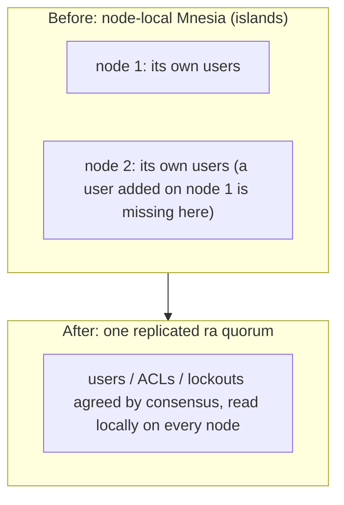

# ADR: authentication and user management

> Status: **Accepted** · Scope: Malachi's authentication, authorization, and user lifecycle
>
> Related: security practices in [SECURITY_DEVELOPMENT.md](SECURITY_DEVELOPMENT.md) · overall design in
> [Architecture](ARCHITECTURE.md)

This record captures the decisions that shape Malachi's auth stack and the reasons behind them. Malachi
aims to be a product that is scalable, secure, and easy to operate, and two questions framed the design: is
it acceptable to ship default credentials hardcoded in the source, and is a node-local user store adequate
for a clustered product? The answers, no and no, drive the decisions below. NorthGuard itself does not
describe authentication (at internal scale it delegates to a platform), so the whole stack is
Malachi-original. It lives in `Malachi.Auth` and `Malachi.Auth.*`, wired into the tree in
`Malachi.Application`.

## Decisions

### Credentials, ACLs, and lockouts live in the replicated `ra` quorum

Users, per-topic ACLs, and account lockouts are each stored in a dedicated `ra` (Raft) cluster
(`Malachi.LogUsers`, `Malachi.LogAcls`, `Malachi.LogLockouts`), the same quorum mechanism the metadata
control plane uses. Each follows the state-machine pattern: a pure registry (`UserRegistry`, `AclRegistry`,
`LockoutRegistry`), a `*Machine` fed `meta.system_time`, a `*Server`, and a stateless facade. Writes go
through consensus; reads use `:ra.local_query` on the local replica, so the replica is the cache and there
is no cross-node ETS sync.

This replaces the former node-local Mnesia store, which never replicated: a user created on one node did
not exist on another, and a new node reseeded from config rather than syncing. Putting this state in one
replicated quorum is how Kafka and Redpanda do it (credentials in the metadata log). It is the right home
because identity is global metadata: small, rarely written, read locally, and critical. The axis that
scales (throughput, node count) is the already-sharded data plane; extreme identity scale is an external
IdP's problem.

> **Analogy.** The old store was each node keeping its own private notebook: add a user on one node and the
> others never heard of it. The `ra` quorum is one shared address book that every node agrees on and can
> read from its own local copy.

**Consequence:** users, ACLs, and lockouts are consistent across the cluster and survive failover. They
survive a restart only when the `ra` log is durable: set `MALACHI_RA_DATA_DIR` to a persistent volume,
because the default is a temp directory that is lost on restart. Brute-force protection is cluster-wide
(attempts on different nodes count against one limit).

### No hardcoded production credentials

The base configuration seeds no users. In production the node generates a random admin password and logs
it (the Redpanda/Elasticsearch pattern), unless one is supplied through the environment. It is a one-time
event only with a persistent `MALACHI_RA_DATA_DIR`; on the temp default the admin is regenerated and
re-logged on every restart.
This is cluster-safe: each node generates one and writes it through consensus, and `ra` deduplicates on
`:user_exists`, so exactly one password wins and is logged. Convenience defaults for producer, consumer,
and app exist only in `config/dev.exs` and `config/test.exs`, never on the production path.

**Consequence:** no secret lives under version control, and dev/staging no longer run on a known password.
The generated admin appears in the log once, so the operator must protect or rotate it, which is the
industry norm.

### Pluggable external authentication, internal authorization

Authentication is pluggable behind the `Malachi.Auth.AuthProvider` contract
(`authenticate(credentials, context) -> {:ok, %{username, permissions}}`), which separates who you are from
what you may do: permissions always come from the internal replicated store.

> **Analogy.** Authentication is the ID check at the door (who are you); authorization is the guest list
> (what may you do). You can swap the door, password, certificate, or token, without touching the guest
> list. See the [authentication guide](guides/authentication.md) for the flow.

Three providers ship:

- **Password** (`PasswordProvider`), wrapping the sessionless `Auth.verify_credentials/2`.
- **mTLS identity** (`MtlsProvider`), mapping a peer certificate to a user through `CertIdentity` (CN or
  SAN, by configurable policy). An `mtls_auth` wire frame makes the acceptor resolve the peer certificate
  and mint a session. It is honored only with opt-in **and** `verify_peer` on, so under `verify_none` a
  forged certificate can never authenticate; mapping failures collapse to `:invalid_credentials` so they do
  not reveal which identities exist.
- **OIDC/JWT** (`JwtProvider`), validating an externally signed token (signature plus `iss`/`aud`/`exp`
  through `JwtValidator` over `joken`/`jose`) and mapping a claim (`sub` by default) to a user. The
  algorithm is pinned by the configured signer, not the token header, so `alg:none` and HS256/RS256
  confusion are rejected; `exp` is mandatory; the config fails closed when a key, issuer, or audience is
  missing. Bearer tokens must travel over TLS.

An OSS product cannot assume a corporate identity platform exists, so it offers the plug points instead. An
LDAP provider over the same contract is a deliberate future addition.

### Per-topic ACLs, allow-only and deny-by-default under strict mode

Beyond the three global permissions (`:admin`, `:produce`, `:consume`), access can be granted per topic:
`{username, :produce | :consume, {:literal, topic} | {:prefix, p}}`, stored in the `LogAcls` cluster.
Enforcement happens at the boundary through `Authorization.allow?`: admin, then the global permission (in
the default non-strict mode), then the ACL, which is consulted through a lazy thunk so the hot path only
pays for the read when it needs it. The non-strict default keeps the global permission as a wildcard, so
enabling ACLs breaks nothing; `MALACHI_ACL_STRICT=true` denies by default, requiring admin or an explicit
grant. Reads fail closed: an unavailable store denies. Deleting a user revokes their grants.

Multi-tenancy (a tenant/namespace hierarchy for real isolation) is a deliberate future addition.

### Sessions stay node-local and ephemeral, on purpose

Unlike users, ACLs, and lockouts, sessions are kept in plain ETS on each node rather than replicated. A
session has a sliding expiry (a write on every validation, so high churn), a poor fit for `ra`; the wire
connection drops on restart anyway, making re-login cheap; and the only cross-node benefit would reach the
low-traffic dashboard. Sessions are otherwise hardened: 32 random bytes per token, IP binding on by
default, expiry, and hijack detection (`Malachi.Auth.SessionManager`).

### Runtime management on four surfaces

User and ACL lifecycle is manageable at runtime, not only at boot, through four surfaces that share the
same `Auth.*` functions (which already go through `ra`): admin-gated **wire operations** (dedicated
api_keys), a **REST API** on the dashboard, a **Node CLI** (`scripts/user.js`, `scripts/acl.js`), and
**mix tasks** (`mix malachi.user`, `mix malachi.acl`) that reach a named running node over Erlang
distribution. The RPC boilerplate is shared through `Malachi.CLI.Rpc`. Passwords cross the wire in the
clear as the handshake does, so run these over TLS in production.

## Alternatives considered

- **For the store:** replicating Mnesia across nodes (`add_table_copy`, the RabbitMQ way) was rejected in
  favor of `ra`, to keep a single replicated quorum for all critical metadata rather than running a second
  replication mechanism with its own netsplit and merge semantics.
- **For credentials:** keeping the defaults and only hardening the gating was rejected because the secret
  would remain in source. Requiring explicit provisioning for every user was rejected as too much
  onboarding friction; a generated admin is the middle path.
- **For sessions:** replicating them was rejected for the churn and low-benefit reasons above.

## How others solve it

| System | AuthN | Where credentials + ACLs live | AuthZ / multi-tenancy | Management |
|---|---|---|---|---|
| **Kafka / Redpanda** | SASL (SCRAM/Kerberos/OAUTHBEARER) + mTLS | in the replicated metadata log (KRaft / controller Raft) | per-resource ACL; pluggable authorizer | CLI + Admin API |
| **RabbitMQ** | internal (Mnesia) + pluggable LDAP/OAuth2/JWT/HTTP | replicated Mnesia | per-vhost permissions (multi-tenant) + topic authz | `rabbitmqctl` + HTTP API + UI |
| **Pulsar** | pluggable: JWT, OAuth2, TLS, Kerberos, Athenz | ZooKeeper/etcd | first-class multi-tenancy (tenant → namespace → topic) | REST admin + CLI |
| **NATS** | decentralized JWT (operator-signed) + nkeys | in the JWTs themselves (no central DB) | accounts (multi-tenant) | `nsc` CLI |
| **NorthGuard** | not described: delegates to LinkedIn's platform | - | - | - |

The lessons that shaped the decisions: credentials and ACLs belong in the same replicated quorum as the
rest of the metadata; pluggable auth and runtime management are table stakes; per-resource ACLs and
multi-tenancy separate a toy from a sellable product.

## References

- Security practices and testing: [SECURITY_DEVELOPMENT.md](SECURITY_DEVELOPMENT.md)
- Overall design: [Architecture](ARCHITECTURE.md)
- Code: `Malachi.Auth`, `Malachi.Auth.*` (`user_*`, `acl_*`, `lockout_*`, `session_manager`, `authorization`,
  `config_validator`, `cert_identity`, and the `*_provider` modules), `Malachi.CLI.Rpc`,
  `config/config.exs`, `config/runtime.exs`.
