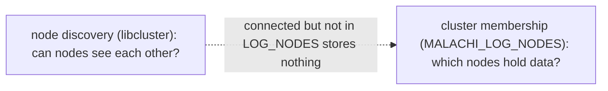
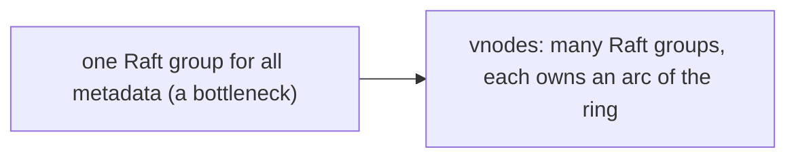
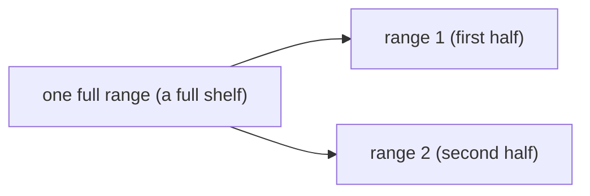

# Clustering and re-sharding

A single node is the default and needs no configuration. This guide covers running several, and growing
the shard count while they serve traffic.

## Two independent axes

Confusing these is the main source of configuration mistakes:

- **Node discovery** decides which BEAM nodes can see each other. That is libcluster, and it is
  connectivity only.
- **Cluster membership** decides which nodes hold data. That is `MALACHI_LOG_NODES`, an explicit list,
  because Raft membership must be explicit.

Discovery never adds a node to the data plane. A node that joins the Erlang cluster but is absent from
`MALACHI_LOG_NODES` stores nothing.



> **Analogy.** Discovery is being in the building; membership is being on the payroll. Walking in the door
> (joining the Erlang cluster) does not put you to work, only the roster (`MALACHI_LOG_NODES`) does.

```bash
MALACHI_CLUSTER_STRATEGY=gossip     # or kubernetes, epmd. Absent = single node
MALACHI_LOG_CLUSTER=true
MALACHI_LOG_NODES=malachi@10.0.0.1,malachi@10.0.0.2,malachi@10.0.0.3
MALACHI_LOG_REPLICATION_FACTOR=3
```

| strategy | for |
|---|---|
| `gossip` | UDP multicast, good on a flat network |
| `kubernetes` | queries the API for pods matching a selector |
| `epmd` | a fixed list of known hosts |

For Kubernetes use a **StatefulSet**, not a Deployment: each pod needs a stable name so
`MALACHI_LOG_NODES` stays meaningful across restarts.

## What gets replicated, and how

Two planes, replicated by different mechanisms, which is the design's central decision:

- **Metadata** (topics, ranges, segment placement) rides on `ra`, one Raft group per vnode.
- **Records** are replicated by a purpose-built quorum: the primary ships a batch to its followers and
  acknowledges once a quorum has **fsynced** it, tolerating ⌊(N-1)/2⌋ slow or unreachable replicas.

Metadata is small, changes rarely and needs linearizability, which is what Raft is good at. Records are
high-volume and sequential, where routing every batch through a consensus log would pay for a second
durable write to no benefit: the segment already *is* the log.

> **Analogy.** Same split as the town-hall minutes versus the warehouse: the minutes (metadata) change
> rarely and everyone must agree; the warehouse (records) takes constant shipments and only needs a majority
> of shelves to confirm storage. See the [two planes diagram](../ARCHITECTURE.md#replication-two-planes).

## Durability and group commit

The baseline is simple and strict: **every produce is fsynced before its ack**. On a single node (rf=1)
that is one fsync on one disk; replicated (rf>1) it is a quorum of replicas each fsyncing before the
ack. You never get an ack for data that only lives in memory.

The cost of that strictness is one fsync per produce, and at high concurrency the disk serializes on
them. **Group commit** is the classic fix: park the concurrent produces briefly, fsync once, then ack
them all; NorthGuard runs this way in production, fsyncing on all replicas every 10ms, 20k records, or
10MB. Malachi implements it as **two independent knobs, one per path**, because the two paths have
different economics:

```bash
# rf=1 (single node): broker-level group commit. Recommended for throughput workloads.
MALACHI_GROUP_COMMIT=true
MALACHI_GROUP_COMMIT_INTERVAL_MS=5        # flush period; also the ~latency each produce pays

# rf>1 (replicated): replication-level group commit. Default OFF; read below before enabling.
MALACHI_REPLICATION_GROUP_COMMIT=true
```

With `MALACHI_GROUP_COMMIT=true` on rf=1, concurrent produces coalesce into one fsync per interval and
the reply still only comes after their batch is durable. Measured on a saturated node it multiplies
small-batch throughput several times over for ~the interval of added latency. Turn it on unless your
workload is latency-critical single-digit-milliseconds.

With `MALACHI_REPLICATION_GROUP_COMMIT=true` on rf>1, the same coalescing happens on **every replica**:
the primary buffers and pushes immediately, each follower buffers too, and on each flush tick every
replica does one fsync covering all batches since the last tick, then acks cumulatively; the produce
ack still waits for a durable quorum. This is exactly the NorthGuard model, and whether it helps
**depends on the shape of your load**, which is why it defaults to off:

- **Turn it ON when many producers hammer the same ranges on fsync-bound disks.** Example: hundreds of
  producers writing to a handful of hot topics, storage where fsync costs milliseconds (HDDs, network
  volumes, dense SSDs under queue pressure). Dozens of batches land on each range per tick, so each
  replica pays one fsync for all of them instead of one each: that multiplication is the win, and it is
  the fleet regime NorthGuard built for.
- **Leave it OFF when load spreads thin across many ranges.** Example: a microservices fleet writing to
  hundreds of topics with a few producers each on NVMe. Each range sees ~1 batch per tick, so there is
  nothing to coalesce: every produce just waits for the tick and throughput drops. Measured on exactly
  that shape: a 3-node rf=3 cluster went from 114k rec/s (per-batch fsync) to 65k with coalescing on.

Rule of thumb: enable it when **batches per range per interval is well above 1** and fsync latency is a
real cost on your disks; verify by watching produce p50 against throughput after flipping it. The two
knobs are deliberately decoupled so the rf=1 win never drags the replicated path along with it.

## Sharding the control plane

With one Raft group for all metadata, that group is a bottleneck. Vnodes shard it:

```bash
MALACHI_LOG_VNODES=8
MALACHI_LOG_VNODE_REPLICATION_FACTOR=3
```

Each vnode owns an arc of the hash ring and runs its own Raft group. A topic's metadata lives in exactly
one vnode, chosen by hashing.



> **Analogy.** One clerk stamping every form is a queue that only grows. Vnodes are many clerks, each owning
> a drawer of the filing cabinet, so requests for different topics are handled in parallel.

## Growing the shard count

When 8 vnodes are no longer enough, grow while running:

```bash
mix malachi.reshard --to 16
```

Each added vnode is created by **one split**: the vnode owning the largest arc is split at its midpoint,
a new Raft cluster starts, and the displaced topics' metadata migrates to it, fenced and copy-first. The
new ring is then published and gossiped so every node routes to the new shard.



> **Analogy.** Splitting a range is like splitting a full shelf into two: you relabel the catalog so half
> the keys point to a new shelf. No book is moved or recopied, only the catalog (the metadata) changes.

Three properties worth knowing:

- **No existing token moves.** Growth only subdivides, so no topic is relocated except those displaced by
  the one split that covers them.
- **Splits run one at a time**, driven only by the node holding the cluster lease. (The lease is the single
  key to a room: only its holder may act, and a node that loses the key stops immediately, so two nodes
  never reshard at once.)
- **It is resumable.** The plan is a pure function of the live ring and the target, so if a reshard is
  interrupted, re-run the same `--to` and it continues from where the ring actually is.

Only **growing** is supported. A target below the current count is rejected; draining a vnode into its
successor is a separate, unimplemented operation.

### While a reshard runs

Clients see `:migrating` on metadata writes touching a fenced topic. This is transient and the correct
response is retry, which the bundled scripts already do. See
[Produce and consume](produce-and-consume.md#two-errors-a-correct-client-handles).

### The durability caveat

The ring is **gossiped cluster state, not durable**. On a full-cluster restart it reseeds from
`MALACHI_LOG_VNODES`, whose even geometry does not match a ring grown by splitting, which would orphan
the migrated metadata.

So treat a reshard as **effective while the cluster is up**. This gap is pre-existing and shared with vnode
split; making the ring durable is tracked as follow-up in
[Architecture](../ARCHITECTURE.md).

## Rebalancing

Placement is rendezvous (HRW) hashing, so adding or removing a node changes the desired placement for some
segments. Moving them is **manual by default**:

```bash
MALACHI_AUTO_REBALANCE=true
MALACHI_AUTO_REBALANCE_INTERVAL_MS=30000
MALACHI_AUTO_REBALANCE_STABILIZATION=3
```

With auto-rebalancing on, the lease holder computes a plan each tick and commits it only after the plan is
**non-empty and identical for `STABILIZATION` consecutive ticks** (default 3, so about 90 seconds). A node
that flaps, briefly suspected then alive again, therefore never moves data: the plan changes, the counter
resets, nothing commits.

> **Analogy.** Placement is a seating rule everyone computes the same way, so when a guest arrives or leaves
> only a few seats change, not the whole room. And before moving anyone's belongings, the host waits to be
> sure the guest really left (the stabilization ticks), so a quick trip to the restroom does not get their
> seat cleared.

## Next

For the dashboard, metrics and TLS, see [Operations](operations.md).
