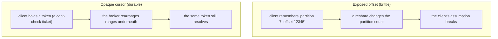
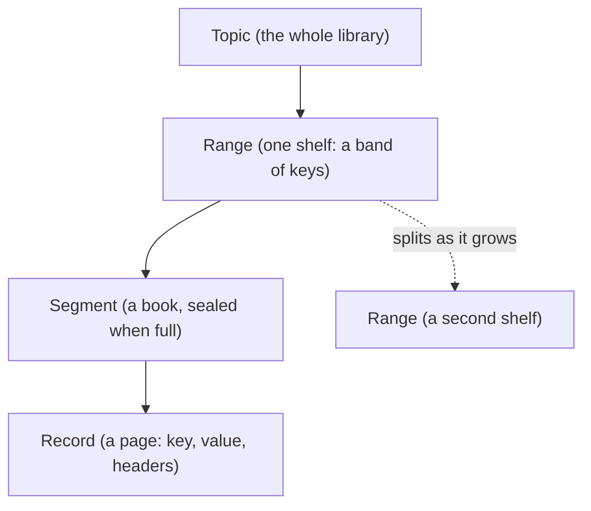

# The log model

Malachi is a log, not a queue. This guide explains the four concepts a client touches, **topic**, **key**,
**cursor**, **consumer group**, and the three the server manages underneath - **range**, **segment**,
**replica set**.

> **Analogy.** A log is an append-only ledger: you only ever write at the end, and you never edit or delete
> what is already there. A queue hands an item out and forgets it; a log keeps everything and lets many
> readers move through at their own pace.

## What a client sees

A client deals in three things and nothing else:

- **topic**: a named, ordered, replicated log.
- **key**: on produce, routes each record to a range of the topic's keyspace. Ordering is guaranteed
  **per key**, not globally.
- **opaque cursor**: on consume, a position token you echo back to continue.

That is the entire client-facing model. There is no partition count to choose, no offset arithmetic, no
rebalance protocol to implement.


> **Analogy.** The key is like a name you file under: the same name always lands on the same shelf, so
> everything for one key stays in order. You never choose the shelf; the hash does.

## Why the cursor is opaque

Internally a cursor encodes per-range positions. It is deliberately opaque so the broker can **split, merge
and restripe ranges while the cluster is running** without breaking clients.

This is the core departure from Kafka, which exposes partitions and offsets to clients. Once a client knows
"partition 7, offset 12345", the partition count is frozen into your clients' assumptions, resharding
becomes a migration event. Here the equivalent change is a server-side operation the client never notices.



> **Analogy.** An opaque cursor is a coat-check ticket. You hold the ticket, not the coat's rack position,
> so the cloakroom can rearrange the racks and your ticket still finds your coat. An exposed offset is like
> memorizing "row 3, hook 5": the moment they rearrange, your note is wrong.

## What the server manages



> **Analogy.** A topic is a library, a range is one shelf holding a band of keys, a segment is a book on
> that shelf (sealed once full, never rewritten), and a record is a page. When a shelf fills up, the library
> adds a second shelf and moves half the books' labels over: no book is recopied, only the catalog changes.

- **Range.** A topic's keyspace is divided into ranges. A record's key hashes to a position, and that
  position lands in exactly one range. Ranges **split** as they grow, which is how a topic scales without
  the client choosing a partition count up front.
- **Segment.** Each range is a series of segments. The active segment takes appends until it crosses its
  size threshold, then it is **sealed** and a new one rolls. Sealed segments are immutable, which is what
  makes re-replicating them safe.
- **Replica set.** Each segment is replicated across nodes chosen by rendezvous (HRW) hashing. A write is
  acknowledged when a **quorum** has it durably (fsync before counting), so the system tolerates
  ⌊(N-1)/2⌋ slow or failed replicas.

Reads never expose any of this. `Malachi.LogApi.fetch/5` returns records plus the next cursor.

## Consumer groups

A cursor you carry yourself is fine for a single reader. For a shared, resumable position, use a **consumer
group**: the server commits the group's position, so a restart resumes where the group left off.

```bash
node consumer.js orders --group workers    # position committed server-side
```

For parallel consumption, run several members of the same group with distinct member ids, the server
assigns each member a share of the topic's ranges and scopes its reads to them. The client still never sees
a range id.

> **Analogy.** A consumer group is a team sharing one bookmark that the server holds. Add members and the
> team also splits the reading, each taking a section, like several people working through one filing
> cabinet, each assigned a set of drawers.

## Durability and ordering, precisely

- **Ordering** is per **range**, and therefore per key (a key always hashes to the same range), never
  global across a topic. Note the guarantee is the range's, not the key's: two different keys that land in
  the same range are also ordered relative to each other, but you must not rely on that, because a range
  split can separate them later.
- **Durability**: a produce is acknowledged after a quorum of the segment's replicas has fsynced it.
- **Delivery**: at-least-once. A consumer group commits positions, so a crash between processing and commit
  re-delivers; make your handlers idempotent.

> **Analogy.** Order is the drawer's, not the surname's. Two letters filed in the same drawer today arrive
> in the order you filed them, but if that drawer is later split in two, they may end up in separate
> drawers. So rely on order only for the same key, never across keys. Durability is a majority of clerks
> signing the receipt before you are told it is stored.

### Same-key ordering survives resharding (the departure from Kafka)

Order for a single key holds even when the topic is resharded, which is where Malachi differs from Kafka.

A key hashes to a fixed position, so every record for that key lands in the same range, and the range's
single primary appends them in the order it receives them. That is the same per-key guarantee Kafka gives
per partition, **but Kafka qualifies it with "as long as the partition count does not change"**: its
client-visible partition is `hash(key) mod partitions`, so raising the partition count moves the key to a
different partition. Its new records go there while its old records stay behind, and the per-key order
breaks.

Malachi never exposes a partition or an offset, only the opaque cursor, so it has no such caveat. A range
split is a metadata operation with a **seal-first fence**: the parent range is sealed before either child
takes a write. A reader of that key then drains the parent's sealed records for its slice of the keyspace
first (oldest first), then the child's new records. The key stays in exactly one child, and its history
reads old-then-new, in order, straight through the split. See [Architecture](../ARCHITECTURE.md) for the
split and the cross-epoch read.

> **Analogy.** Kafka resharding is like renumbering everyone's mailbox: your old and new mail land in
> different boxes. Here you hold a coat-check ticket, not a box number, so the cloakroom can split a rack in
> two and the ticket still walks you through your coats in the order you left them.

## Where this is going

Ranges splitting is one axis of scale; the **metadata** itself is the other. The control plane is sharded
across virtual nodes (each its own Raft group) and supports online **vnode split** and **grow re-sharding**.
See [Architecture](../ARCHITECTURE.md) for how that works.

> **Analogy.** There are two ways to grow a library: add more shelves (split ranges to hold more records),
> and hire more librarians each owning a section of the catalog (shard the metadata). Malachi does both,
> while the library stays open.
