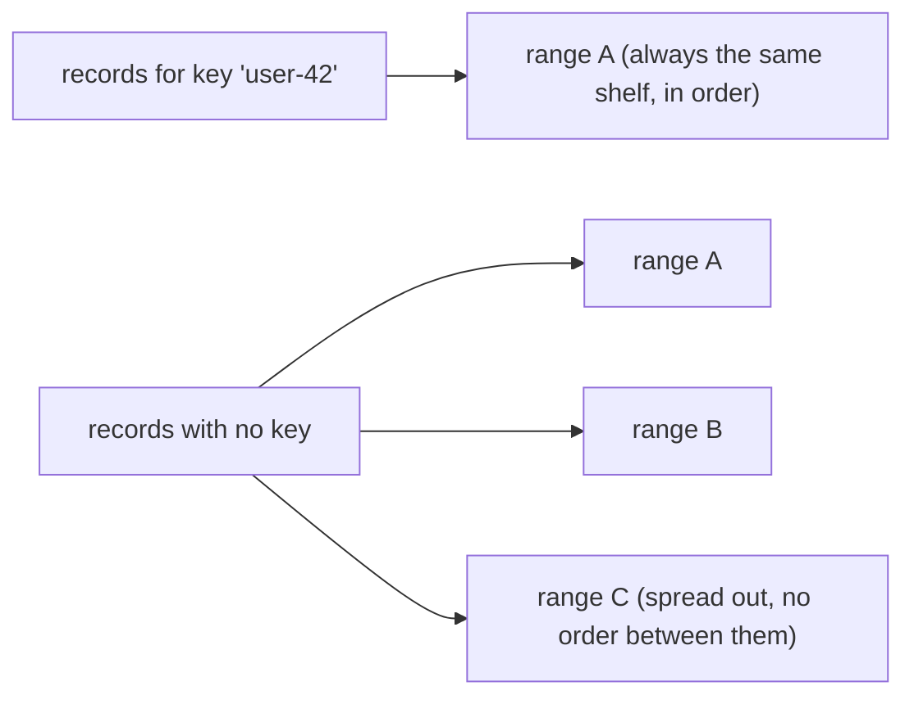
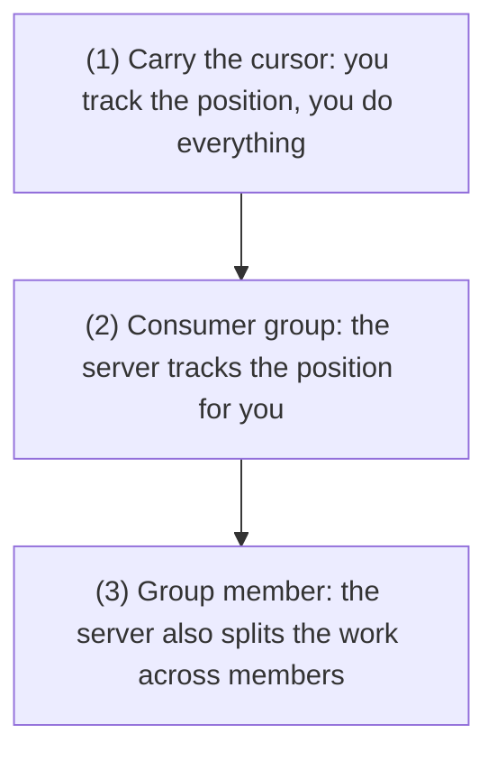
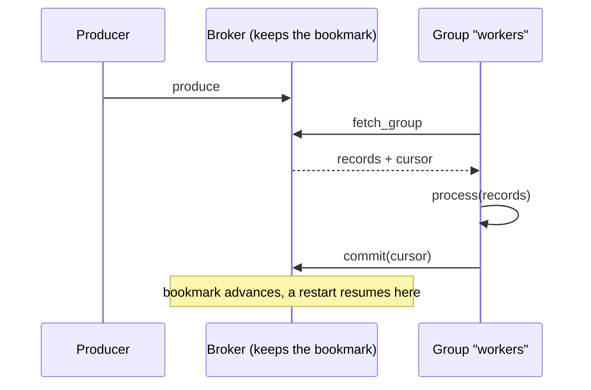
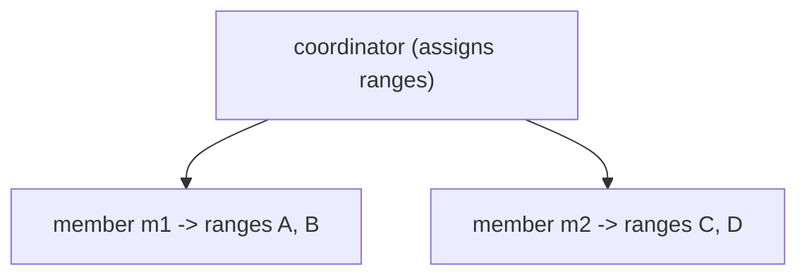

# Produce and consume

[Getting started](getting-started.md) showed the shortest path to a record landing and coming back. This
guide is the working detail: how keys decide ordering, the three ways to track a position, what
at-least-once obliges you to do, and the two errors a correct client must expect.

## Producing

A record is a value, an optional key, and optional headers:

```elixir
LogApi.produce(Malachi.LogBroker, "orders", [
  %{"key" => "user-42", "value" => "created", "headers" => %{"source" => "api"}}
])
#=> {:ok, 1}
```

The reply is a **count, not an offset**. Nothing in the produce path hands the client a position, which is
what lets ranges split underneath without breaking anyone.

> **Analogy.** You get a receipt that says "3 items stored", not "shelf 7, slot 12". The broker keeps the
> right to rearrange the shelves, so it never tells you a slot number you might come to depend on.

### Batch, don't loop

`produce/3` takes a list, and the whole list is one round trip and one quorum wait. Appending 100 records
one call at a time pays that cost 100 times:

```elixir
# one round trip, one quorum ack
LogApi.produce(Malachi.LogBroker, "orders", Enum.map(events, &%{"key" => &1.user, "value" => &1.body}))
```

### Keys decide ordering, not delivery

A key hashes to a position in the topic's keyspace, and that position lands in exactly one range. Records
with the same key therefore go to the same range and are **ordered relative to each other**.



> **Analogy.** A key is what you file under, like a surname. Everything for "user-42" goes in the same
> drawer, in order. Leave the key off and the records scatter across drawers to be filed faster, with no
> order between them.

A key is not an address and not a filter. There is no "read the records for key X"; a consumer reads
ranges, and a range holds many keys. If you need per-entity streams, the entity is the key and you filter
client-side, or you use a topic per entity class.

Omit the key and records are distributed across ranges, which maximises parallelism and gives you **no**
ordering between them.

## Consuming

Three ways to track position, in increasing order of what the server does for you.



> **Analogy.** These are three levels of service. Level 1 is do-it-yourself, you keep your own place. Level
> 2 is a shared bookmark the server holds. Level 3 also hands each teammate a section, so the group reads
> the topic in parallel.

### 1. Carry the cursor yourself

```elixir
{:ok, records, cursor} = LogApi.fetch(Malachi.LogBroker, "orders", :start, 100)
{:ok, more, cursor} = LogApi.fetch(Malachi.LogBroker, "orders", cursor, 100)
```

`:start` (or `nil`) begins at the beginning. Pass the returned cursor back to continue. The position lives
in your process, so it dies with your process. Good for a one-off scan or an export.

> **Analogy.** This is holding your place with your own finger. It works while you are reading, but the
> moment you close the book (your process exits) the place is lost. Nobody else can pick up where you were.

### 2. Consumer group: the server commits for you

```elixir
{:ok, records, cursor} = LogApi.fetch_group(Malachi.LogBroker, "orders", "workers", 100)
:ok = process(records)
:ok = LogApi.commit(Malachi.LogBroker, "orders", "workers", cursor)
```

The group's position is durable, so a restart resumes where the group left off. **Commit after you
process**, never before, or a crash silently skips records.



> **Analogy.** A consumer group is a shared to-do list where the server holds the bookmark. Any worker can
> pick up where the group left off, even after a restart, because the bookmark lives on the server, not in
> any one worker's memory. You move the bookmark (`commit`) only after the work is done.

### 3. Group member: the server also splits the work

Run several members of one group with distinct member ids and the coordinator assigns each a share of the
topic's ranges:

```bash
node consumer.js orders --group workers --member m1 &
node consumer.js orders --group workers --member m2 &
```

Each member reads only its assigned ranges, and the assignment rebalances when members join or leave. The
client still never sees a range id.



> **Analogy.** The coordinator is a shift lead splitting a stack of work among the crew. Each member gets
> its own pile (some ranges) and works only that. When someone clocks in or out, the lead re-deals the
> piles.

### Long polling

`fetch/5` and `fetch_group/5` take a final `wait_ms`. With `0` the call returns immediately, empty if
there is nothing new. With a timeout the server holds the request open until a record arrives or the wait
expires, which is how `--follow` avoids a busy loop:

```bash
node consumer.js orders --follow
```

> **Analogy.** Long polling is waiting at a door that opens the moment a package arrives, instead of
> knocking every second to ask. You spend one held-open request rather than a busy loop of empty checks.

## At-least-once, and what it costs you

A consumer group commits **after** processing, so a crash in between re-delivers the batch. There is no
configuration that turns this into exactly-once.

> **Analogy.** Think of a mail carrier who re-delivers a package whenever they are not sure it arrived. You
> might get the same package twice, so opening it must be safe to do twice: that is what "idempotent" means.

**Your handlers must be idempotent.** In practice that means one of:

- a natural idempotency key in the record, and a write that is a no-op the second time (an upsert on that
  key, `INSERT ... ON CONFLICT DO NOTHING`),
- or a dedupe table of processed record ids, checked before the side effect.

The failure this prevents is not theoretical: it happens on every deploy that restarts a consumer between
a fetch and its commit.

## Two errors a correct client handles

Both are transient and both mean retry, not fail:

| error | when | what to do |
|---|---|---|
| `:migrating` | a metadata write hit a topic whose range is being split or migrated | back off and retry; the fence lifts in milliseconds |
| `:not_owner` | the read reached a node that no longer owns that range, after a failover or rebalance | re-resolve the owner and retry |

> **Analogy.** Both mean "the shop is briefly rearranging, come back in a moment", not "gone for good".
> Treating them as fatal is like seeing a "back in 5 minutes" sign and concluding the store closed forever.

The bundled scripts handle both: `:migrating` through the `withRetry` helper in
[`scripts/lib/cli.js`](https://github.com/HectorIFC/malachi/blob/main/scripts/lib/cli.js), and
`:not_owner` with a back-off around the fetch. Each prints a grey `~` per attempt, so you can watch a
split or a failover happen live. A client that treats either as fatal will appear to fail at random under
an otherwise healthy resharding.

## Next

Polling is one shape. For server-push with flow control, see
[Streaming with backpressure](streaming-with-backpressure.md).
