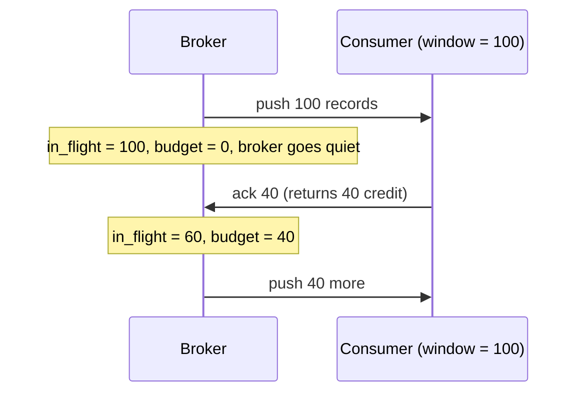
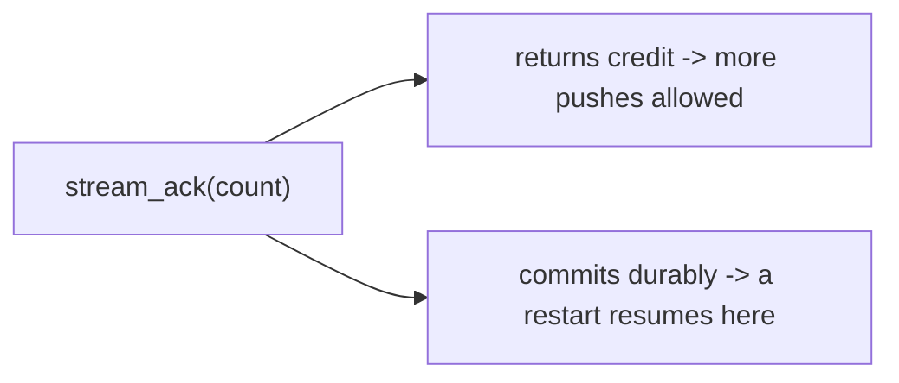

# Streaming with backpressure

[Produce and consume](produce-and-consume.md) covers polling: the client asks, the server answers. This
guide covers the push direction, where the server sends records as they are produced, and the flow control
that keeps a fast producer from burying a slow consumer.

## Why a credit window

Server push without flow control is a loaded gun. If the broker sends every record the moment it lands,
a consumer that processes slower than the producer appends accumulates an unbounded mailbox until the node
runs out of memory. The consumer never gets to say "stop".

Malachi makes the consumer's capacity explicit. A subscription declares a **window**: the maximum number
of records that may be in flight, meaning pushed but not yet acked. The broker will not exceed it.



> **Analogy.** The window is a kitchen pass. The broker sends out up to N plates; it cannot send more until
> you hand plates back (each `ack` returns credit). A slow consumer simply gets fewer plates, and the
> kitchen never buries it under a pile it cannot clear.

The budget for each push is exactly:

```elixir
budget = min(max, window - in_flight)
```

`max` caps a single push, `window` caps the total outstanding. When the budget reaches zero the broker
stops pushing to that subscriber and does no further work for it. Backpressure here is the absence of
sends, not a queue building up somewhere.

## Subscribing

```elixir
:ok = LogApi.subscribe(Malachi.LogBroker, "orders", "live", 100, 50)
```

That registers the **calling process** as a push subscriber, resuming from the group's committed position.
Records arrive as ordinary messages:

```elixir
receive do
  {:log_records, topic, records, positions} ->
    :ok = handle(records)
    cursor = LogApi.encode_cursor(positions)
    :ok = LogApi.stream_ack(Malachi.LogBroker, topic, "live", cursor, length(records))
end
```

Note the fourth element is internal **positions**, not the opaque cursor. `stream_ack/5` takes a cursor,
so encode it first. That asymmetry exists because the push path hands the subscriber the raw position and
lets whoever owns the connection mint the client-facing token; the TCP acceptor does exactly this before
putting the batch on the wire.

> **Analogy.** The raw `positions` are the cloakroom's internal rack coordinates; the cursor is the ticket
> the customer gets. Over the network you always hand out the ticket, so if you ack from Elixir you mint the
> ticket yourself first with `encode_cursor/1`.

From the shell:

```bash
node subscriber.js orders --group live --window 500
```

## The ack does two jobs

`stream_ack/5` is one call with two effects, and conflating them is deliberate:

1. **Returns credit.** `count` records of window space, which unblocks further pushes.
2. **Commits durably.** The group's position advances, so a restart resumes here.



> **Analogy.** Handing a plate back to the kitchen does two things at once: it frees a slot for the next
> plate (credit) and it tells the kitchen that order is served (commit). You cannot free the slot without
> also marking it served, which is exactly what stops you from losing records.

You cannot return credit without committing. That is what makes the window safe: the broker can only
consider a record delivered once you have durably said you are done with it. Ack a batch before you
process it and you have converted at-least-once into at-most-once, silently.

Delivery is **at-least-once**, same as polling: a crash between the push and the ack re-delivers. The
idempotency obligation from [Produce and consume](produce-and-consume.md#at-least-once-and-what-it-costs-you)
applies unchanged.

## Sizing the window

The window is a latency/throughput dial, not a correctness setting.

- **Too small** and the consumer idles between pushes, waiting on round trips. The floor is your
  processing time per record times the round-trip time.
- **Too large** and you are back to an unbounded mailbox, with the added cost that everything in flight is
  re-delivered on a crash.

Start at a few times the batch size you actually process at once, and raise it only if the consumer is
demonstrably starved. The default of 100 is a reasonable place to begin.

> **Analogy.** The window is a Goldilocks dial. Too small and the consumer keeps waiting on the next
> delivery; too large and you are back to an unbounded pile that all has to be re-sent after a crash. Aim
> for "just enough in flight to stay busy".

## Parallel streaming with members

One subscriber per group reads the whole topic. To spread the load, give each process a member id:

```bash
node subscriber.js orders --group live --member m1 &
node subscriber.js orders --group live --member m2 &
```

The coordinator assigns each member a share of the topic's ranges and the broker scopes that member's push
stream to them. Each member carries its **own** window, so total in-flight is the sum across members.

In Elixir, `subscribe_member/7` and `stream_ack_member/7` are the member-scoped equivalents.

> **Analogy.** Each member is its own faucet with its own credit window; the total flow to the group is the
> sum of the faucets. Add members to open more faucets, up to the number of ranges to hand out.

### Members must keep acking

A member ack is also a **heartbeat**: it re-polls the coordinator, which both refreshes the member's range
assignment (so a rebalance is picked up on the next ack) and proves the member is alive.

A member that goes quiet, because it is idle rather than dead, would eventually be treated as gone and have
its ranges reassigned. So an idle member sends a periodic empty ack:

```bash
node subscriber.js orders --group live --member m1 --heartbeat 10000
```

If you implement your own client, this is the part most likely to bite: an idle stream that never acks
looks exactly like a dead one.

> **Analogy.** An ack is answering roll call. A member that stays silent, even if it is just idle, is
> eventually marked absent and has its work handed to someone else. So idle members still say "here" with a
> periodic empty ack.

## Choosing between push and poll

| | poll (`fetch_group`) | push (`subscribe`) |
|---|---|---|
| who drives | client asks | server sends |
| flow control | implicit, you ask when ready | explicit credit window |
| idle cost | a long-poll held open | nothing in flight |
| best for | batch jobs, scans, simple consumers | low-latency fan-out to live consumers |

Both commit through a consumer group, so you can move a workload from one to the other without losing
position.

> **Analogy.** Push is a newspaper subscription: it arrives at your door as it is printed. Poll is checking
> your mailbox when you feel like it. Same news, different way of getting it, and you can switch without
> losing your place.
